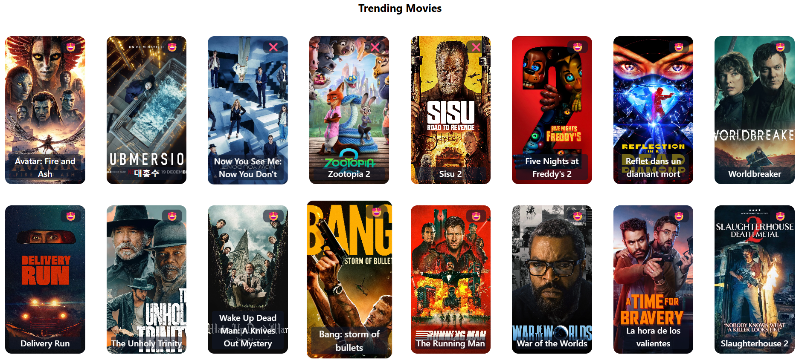
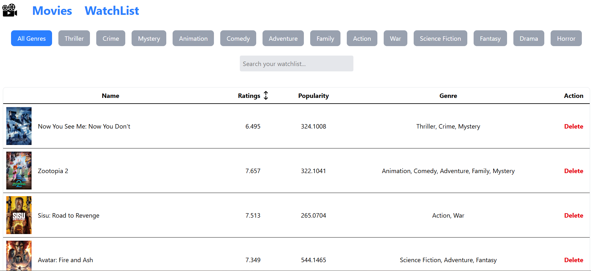

# 🎬 FilmVault


---

## 🎥 FilmVault — Movie Discovery & Watchlist App

**FilmVault** is a modern movie discovery web application built using **React (Vite)** and **Tailwind CSS**, powered by **The Movie Database (TMDB) API**.  
It allows users to explore trending movies, filter by genres, and manage a personalized watchlist with persistent storage.

This project demonstrates **frontend engineering best practices**, API integration, state management, and responsive UI design.

---

## 🚀 Features
- 🎞 Browse trending & popular movies (TMDB API)
- 🎭 Filter movies by genre
- ⭐ Add / remove movies from a persistent watchlist
- 📄 Pagination for large datasets
- 📱 Fully responsive UI (mobile-first)
- ⚡ Fast builds & hot reload using Vite

---

## 🛠 Tech Stack
- **Frontend:** React, Vite
- **Styling:** Tailwind CSS
- **Routing:** React Router
- **API Handling:** Axios
- **Data Source:** TMDB API
- **Deployment:** Netlify

---

## 🔑 TMDB API Integration
This project fetches real-time movie data from **The Movie Database (TMDB)**.

### Setup Instructions:
1. Create an account at https://www.themoviedb.org/
2. Generate an API key
3. Store the API key securely (e.g., environment variable)
4. Use the key to fetch movie data from TMDB endpoints

## 📸 Screenshots

### 🏠 Home Page


### 🎬 Movie Listings


### ⭐ Watchlist



## Getting Started
Ensure you have a recent Node.js LTS and npm installed.

```bash
# install dependencies
npm install

# start dev server (Vite)
npm run dev

# production build
npm run build

# preview local production build
npm run preview

# lint the project
npm run lint
```

## Project Structure
```
FilmVault/
	eslint.config.js
	index.html
	package.json
	README.md
	vite.config.js
	src/
		App.css
		App.jsx
		index.css
		main.jsx
		Assets/
		Components/
			Banner.jsx
			Movie.jsx
			Movies.jsx
			Navbar.jsx
			Pagination.jsx
			WatchList.jsx
		utility/
			genre.js
```

## Live Demo
🔗 **Live Demo:** https://filmvaulttmdb.netlify.app/

## 🎯 What This Project Demonstrates
- API integration & async data handling
- Component-based React architecture
- Clean UI with Tailwind CSS
- State management & localStorage usage
- Pagination & performance optimization
- Production-ready deployment workflow


## 🤝 Contribution
Pull requests are welcome.  
For major changes, please open an issue first to discuss the proposed updates.

⭐ If you like this project, consider giving it a star!


